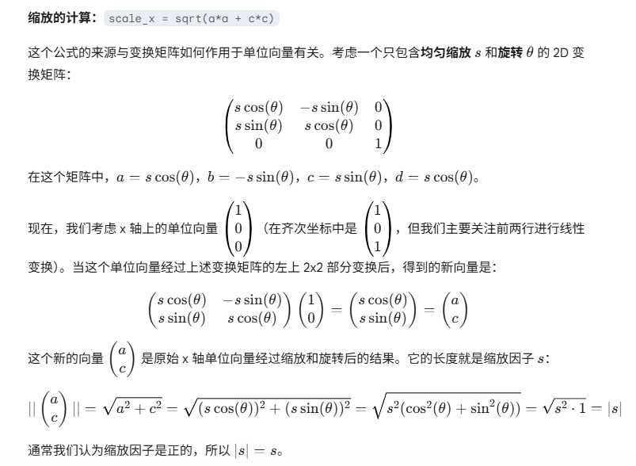
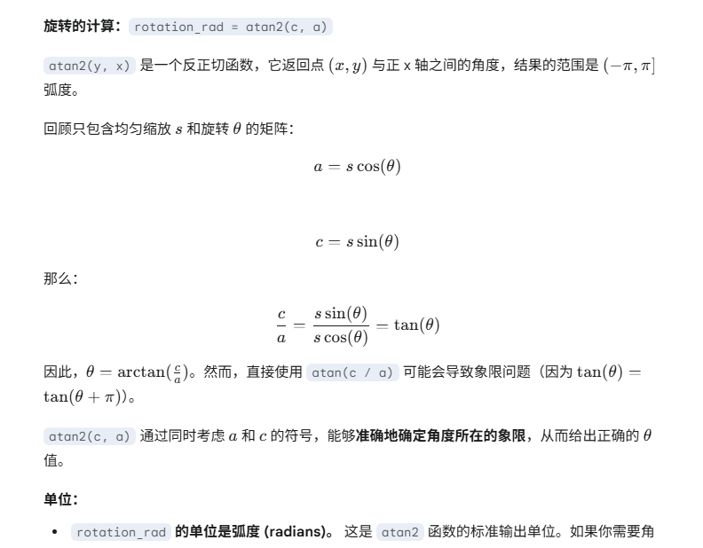

# 手势内容变换控制


## 矩阵计算

通过基准向量、变换向量计算 `matrix`，实现手势s内容变换

1. 记录 down 激活 pointers
2. 记录 move 状态 pointers
3. 确定可用点，根据可用点得到基准向量、变换向量
4. 根据基准向量、变换向量计算 scale、skew、translate
5. 得到此次操作的 matrix


## 矩阵变换

或者，对于列向量，等价地表示为：

```matlab
[x']   [a b tx][x]   [a*x1 + b*y1 + tx] 
[y'] = [c d ty][y] = [c*x1 + d*y1 + ty] 
[1]    [0 0 1][1]    [1]  
```


```matlab
x1' = a*x1 + b*y1 + tx
y1' = c*x1 + d*y1 + ty
```


### 概念


#### 向量运算

##### 点乘 (Dot Product / Scalar Product)

二维向量的点乘定义如下：

```matlab
a⋅b = ax * bx + ay * by
```

点乘的结果是一个标量（一个数值），而不是一个向量。

**几何意义:**

点乘与两个向量之间的夹角 θ 有关：

```matlab
a⋅b =∣a∣∣b∣cosθ
```


因此，我们可以得到夹角余弦的表达式： cosθ = a⋅b / (∣a∣∣b∣)


通过单位矩阵直接求 cosθ

```matlab
u · v = |u| * |v| * cos(θ) = cos(θ) （因为 |u| = |v| = 1）
```


##### 差乘 (Cross Product / Vector Product)

**二维向量的差乘（标量结果）定义为:**

```matlab
a × b = ax * by − ay * bx
```

**几何意义:**

二维向量的叉乘结果的绝对值 ∣ax * by − ay * bx∣ 等于以向量 a 和 b 为两边的平行四边形的面积。

差乘结果的绝对值等于以向量 a 和 b 为两边的平行四边形的面积。

这个面积也可以用向量的模长和它们之间夹角的正弦来表示： 

```matlab
∣a × b∣=∣a∣∣b∣∣sinθ∣
```


通过单位矩阵直接求 sinθ

```matlab
∣u × v∣= |u| * |v| * sin(θ) = sin(θ) （因为 |u| = |v| = 1）
```


#### skew

角度、弧度、skew 关系

| 类型 | 表示什么             | 单位    | 示例                   |
| ---- | -------------------- | ------- | ---------------------- |
| 弧度 | 旋转角度（数学常用） | Radians | π/2 = 90°              |
| 角度 | 旋转角度（直觉型）   | Degrees | 180°, -45°             |
| Skew | 非旋转的斜切变形     | Degrees | SkewX(30°), SkewY(15°) |


```c#
double skewX_deg = 30;
double skewX_rad = skewX_deg * Math.PI / 180;
double matrixC = Math.Tan(skewX_rad); // skewX 的矩阵值
```


#### 缩放

两个向量的模长之比

```matlab
s = ∣b∣ / ∣a∣
```


#### 旋转

这个方法会生成一个矩阵，把任何一个点 **围绕原点旋转 `angle` 弧度**。

它创建的矩阵是：

```matlab
|  cos(angle)   -sin(angle) |
|  sin(angle)    cos(angle) |
|     0              0      |
```

这个矩阵应用于一个点 `(x, y)`，会产生绕原点旋转的效果：

```js
x' = x * cosθ - y * sinθ
y' = x * sinθ + y * cosθ
```


#### 位移

两个线段对应的两个中心点位移

```matlab
deltaX = c2x - c1x
deltaY = c2y - c1y
```


#### 计算缩放、旋转、位移


根据缩放、旋转参数直接计算出缩放旋转对应矩阵

```
|  s * cos(angle)   -s * sin(angle) |
|  s * sin(angle)    s * cos(angle) |
|     0              0              |
```

计算

##### cosθ

$$
cosθ = \frac{\mathbf{a} \cdot \mathbf{b}}{|\mathbf{a}|\cdot|\mathbf{b}|}
$$

##### sinθ

$$
sinθ =  \frac{\mathbf{a} \times \mathbf{b}}{|\mathbf{a}|\cdot|\mathbf{b}|}
$$


##### 模长

$$
|\mathbf{a}| = \sqrt{a_x^2 + a_y^2 }
$$


##### s 缩放

$$
s =  \frac{|\mathbf{b}|}{|\mathbf{a}|}
$$


##### 缩放旋转矩阵

$$
\begin{pmatrix}
  s * cosθ & -s * sinθ & e \\
  s * sinθ & s * cosθ & f \\
  0 & 0 & 1
\end{pmatrix}
$$


**计算**

$$
\begin{pmatrix}
  \frac{|\mathbf{b}|}{|\mathbf{a}|} * \frac{\mathbf{a} \cdot \mathbf{b}}{|\mathbf{a}|\cdot|\mathbf{b}|} & - \frac{|\mathbf{b}|}{|\mathbf{a}|} * \frac{\mathbf{a} \times \mathbf{b}}{|\mathbf{a}|\cdot|\mathbf{b}|} & e \\
  \frac{|\mathbf{b}|}{|\mathbf{a}|} * \frac{\mathbf{a} \times \mathbf{b}}{|\mathbf{a}|\cdot|\mathbf{b}|} & \frac{|\mathbf{b}|}{|\mathbf{a}|} * \frac{\mathbf{a} \cdot \mathbf{b}}{|\mathbf{a}|\cdot|\mathbf{b}|} & f \\
  0 & 0 & 1
\end{pmatrix}
$$


**结果**


$$
\begin{pmatrix}
  \frac{\mathbf{a} \cdot \mathbf{b}}{|\mathbf{a}|^2} & - \frac{\mathbf{a} \times \mathbf{b}}{|\mathbf{a}|^2} & e \\
   \frac{\mathbf{a} \times \mathbf{b}}{|\mathbf{a}|^2} &  \frac{\mathbf{a} \cdot \mathbf{b}}{|\mathbf{a}|^2} & f \\
  0 & 0 & 1
\end{pmatrix}
$$


**公式**

$$
\begin{pmatrix}
  \frac{a_x \cdot b_x + a_y \cdot b_y}{a_x^2 + a_y^2} & - \frac{a_x \cdot b_y − a_y \cdot b_x}{a_x^2 + a_y^2} & e \\
   \frac{a_x \cdot b_y − a_y \cdot b_x}{a_x^2 + a_y^2} &  \frac{a_x \cdot b_x + a_y \cdot b_y}{a_x^2 + a_y^2} & f \\
  0 & 0 & 1
\end{pmatrix}
$$


## 有效点

### IOS 有效点算法

1. 最多两个有效点
2. 已经存在两个有效点时，再增加点视为无效


## 触发阈值

当超过阈值时才会触发对应操作


1. 点位移过阈值后则为有效点？
2. 位移超过阈值，缩放、旋转未超过阈值，仅位移
   1. 更新初始值，以超过阈值坐标为起点
3. 








## 参考连接

[初识矩阵](https://juejin.cn/post/6880324397882834957#heading-2)
